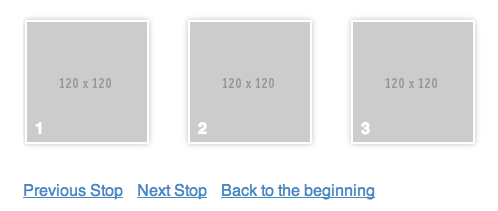

# Conveyor

Conveyor is a simple, dumbed-down horizontal slider. It was written to animate stops in a road-trip landing-page.




## Usage

1. Import the JS and CSS somewhere in your page

```html
<link rel="stylesheet" href="css/conveyor.css">

<script src="//ajax.googleapis.com/ajax/libs/jquery/1.10.2/jquery.min.js"></script>
<script src="js/jquery.conveyor.js"></script>
```

2. Create the conveyor structure

```html
<div class="conveyor">
    <ul class="items">
        <li>
            
        </li>
        <li>
            
        </li>
        <!-- ... -->
    </ul>
</div>
```

3. Init the conveyor

```js
$(function() {
    var slider = $('.conveyor .items').conveyor();
});
```

## Add a control board to your conveyor

There is a `scrollTo()` and an `index()` method that you can use to add controls to the conveyor

```js
var slider = $('.conveyor .items').conveyor();

$('.control-previous').click(function() {
    slider.scrollTo(slider.index() - 1);
});

$('.control-next').click(function() {
    slider.scrollTo(slider.index() + 1);
});

$('.control-start').click(function() {
    slider.scrollTo(0);
});
```


## Requirements

- jQuery


## License

Conveyor is released under the MIT License. See the bundled [LICENSE]() file for details.